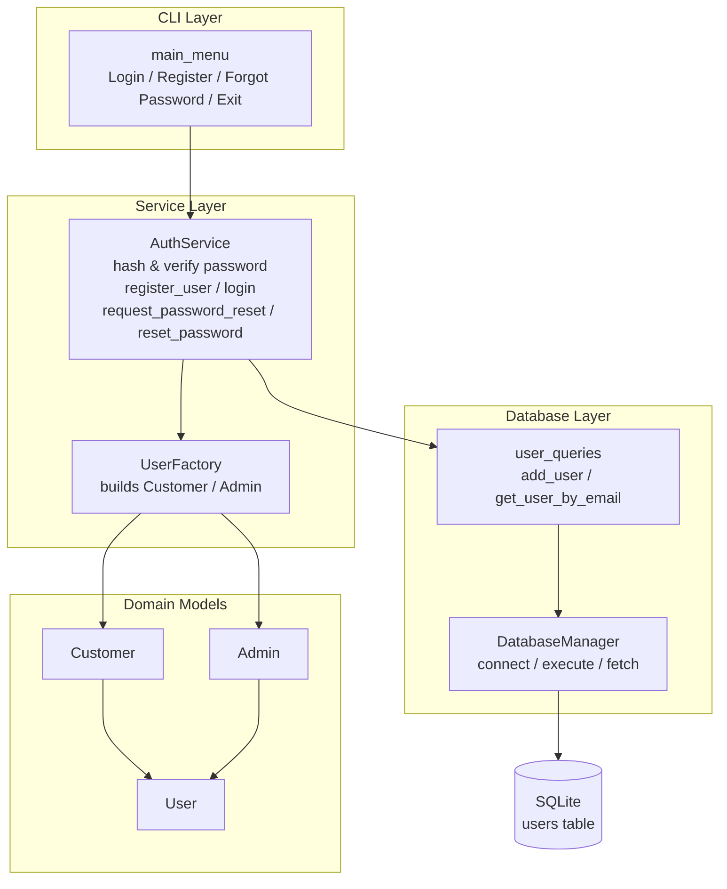
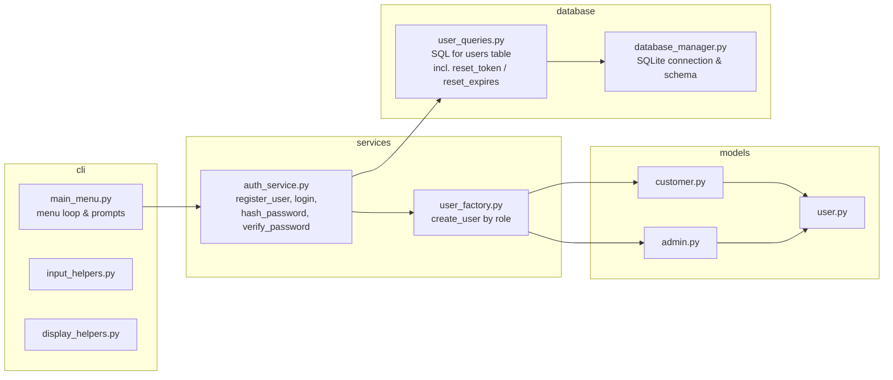
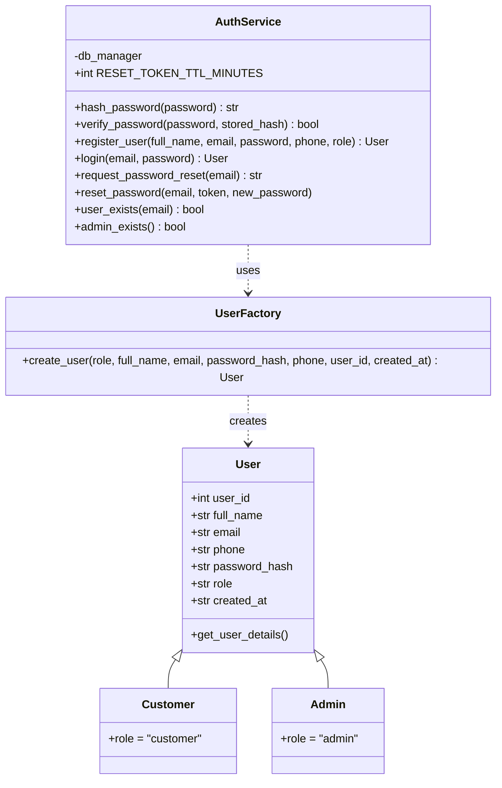
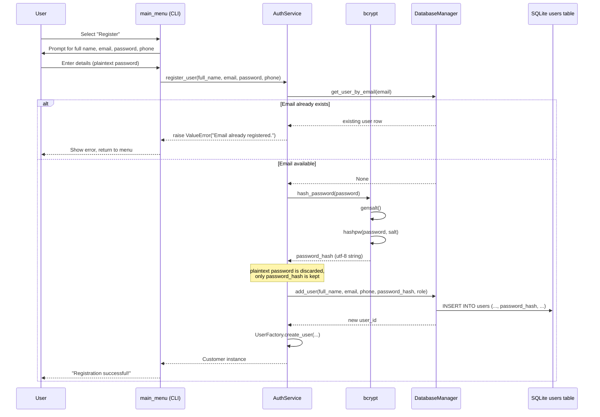
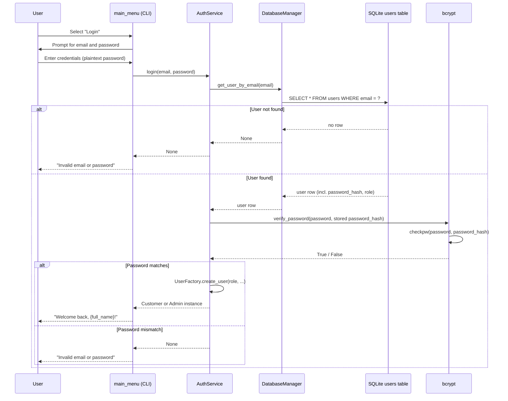
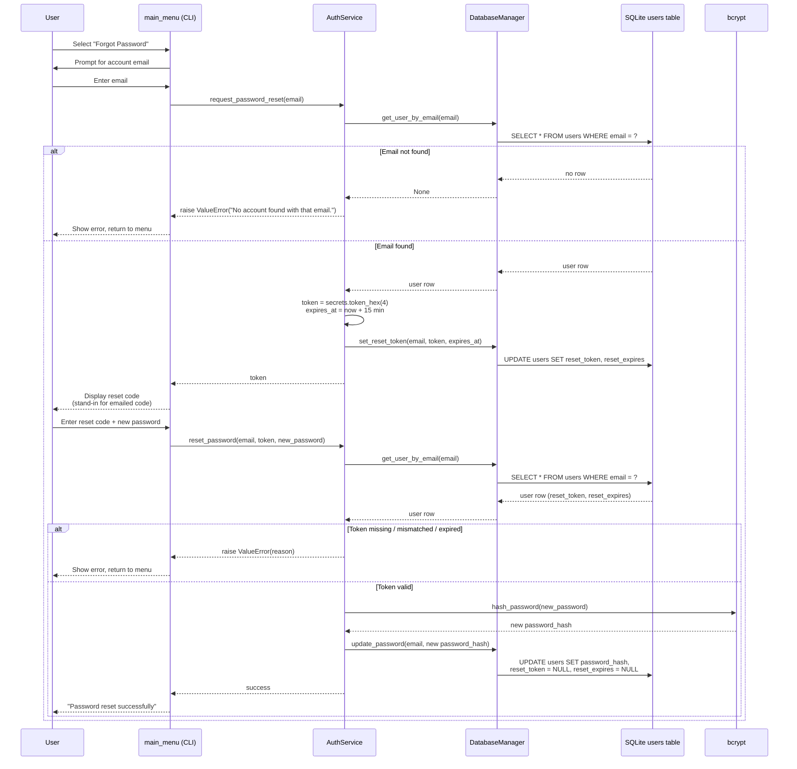
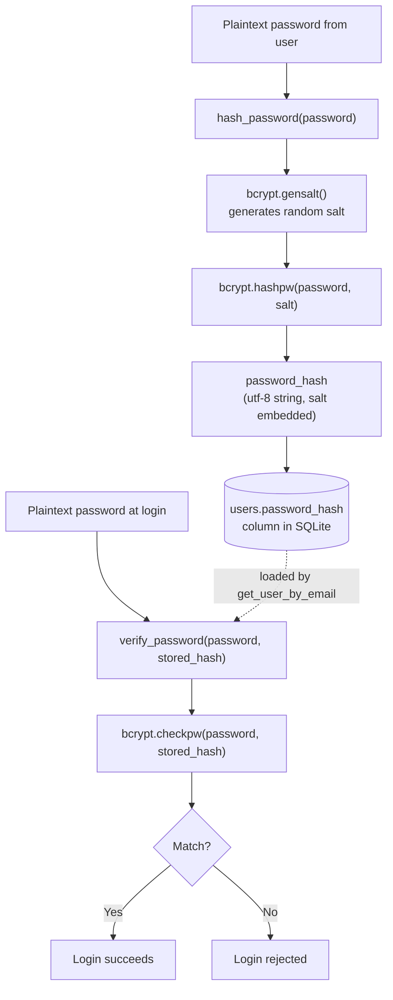
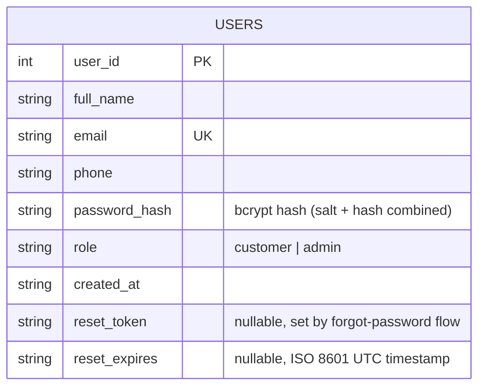

# Login / Registration Demo System for Ako-Puku

A minimal authentication system for **Ako-Puku** (A Web-Based Te Reo Māori Flashcard and Learner Progress System), covering account **registration**, **login**, and **forgot password** via a command-line interface. The system uses a single SQLite `users` table and a small set of well-separated modules (CLI, Services, Database, Models) to keep the codebase lean and easy to read.

**DEVELOPMENT TEAM - Group E**

- Yirong Chen
- Eric Gomez

## System Architecture



## Module Breakdown



## Class Diagram



## Registration Flow



## Login Flow



## Forgot Password Flow

The CLI demo combines token generation and reset into a single interactive flow: the reset code would be emailed in a production system, but here it is printed to the console so the flow can be tested end-to-end without an email provider.



## Password Hashing & Storage (bcrypt)

`AuthService` never stores or compares plaintext passwords. It relies on `bcrypt` for one-way hashing (registration) and constant-style verification (login).



**Key points:**

- `hash_password()` is called once during `register_user()` — the plaintext password is hashed with a freshly generated salt (`bcrypt.gensalt()`) and the result (`password_hash`) is the **only** thing written to the `users` table.
- `password_hash` is a self-contained bcrypt string (algorithm version + cost factor + salt + hash), so no separate `salt` column is needed.
- `verify_password()` is called once during `login()` — it re-hashes the submitted password using the salt embedded in `stored_hash` via `bcrypt.checkpw()` and compares the result, without ever decrypting the stored hash.
- The plaintext password only ever exists in memory for the duration of `register_user()` / `login()` and is never logged or persisted.

## Data Model



## Design Principles

- **Maintainability** — Clear separation between CLI, services, models and database layers, each with a single responsibility.
- **Security** — Passwords are never stored in plaintext; `bcrypt` is used to hash and verify credentials.
- **Extensibility** — `UserFactory` and the `User`/`Customer`/`Admin` hierarchy allow new roles or fields (e.g. learner progress) to be added without reworking the auth flow.
- **Readability** — A single `users` table and three CLI actions (Login / Register / Forgot Password) keep the whole flow easy to follow at a glance.

## Future Enhancements

- Profile management (edit full name, add date of birth)
- Send the reset code by email instead of printing it to the console
- Integration with the Ako-Puku flashcard and learner progress modules

## Running the Demo

```bash
pip install -r requirements.txt
python3 main.py
```

The app creates its own `login_signup.db` SQLite file on first run.
