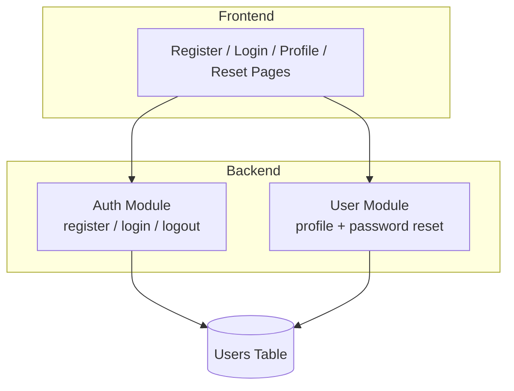
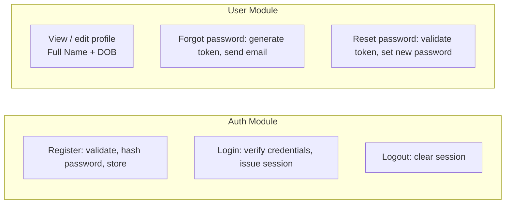
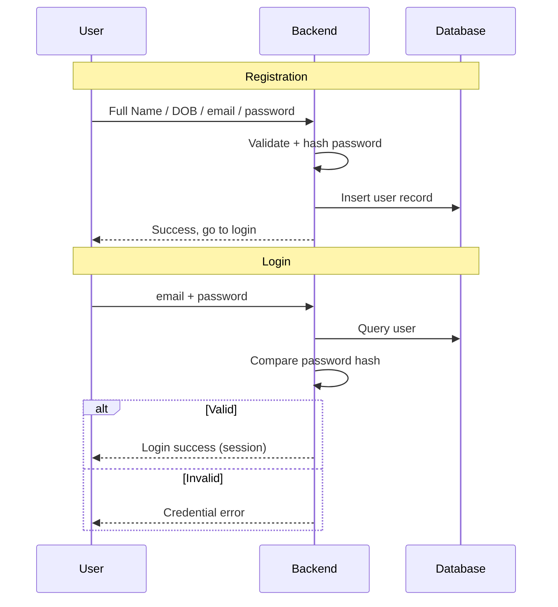
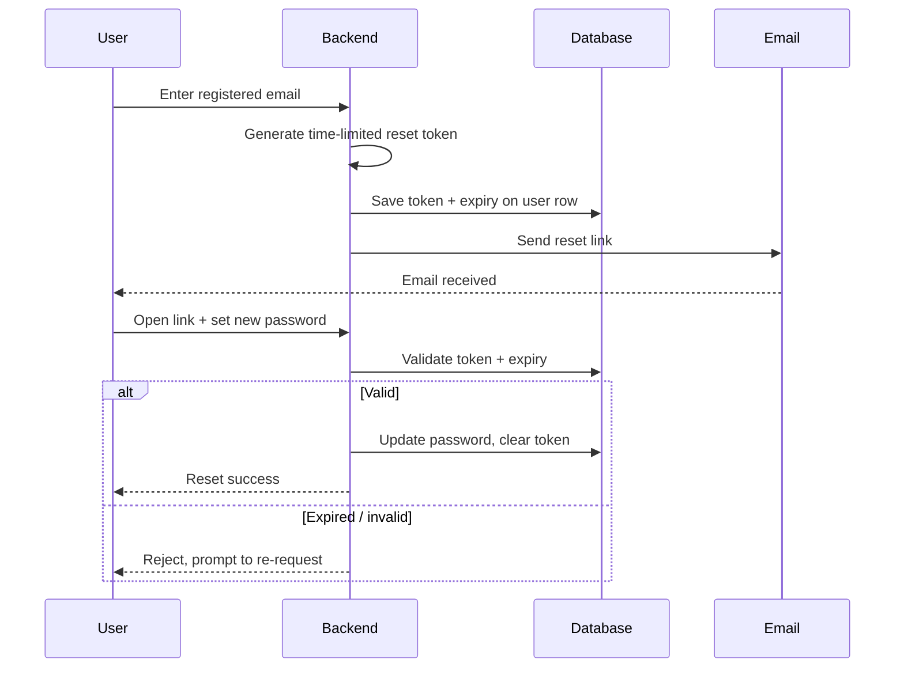
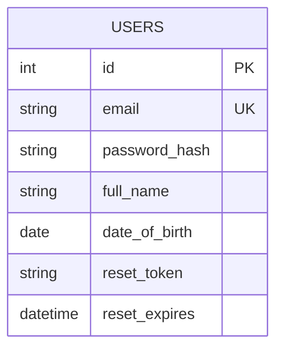

# Login / Registration System For Ako-puku demo

A minimal authentication system covering registration, login, profile management (Full Name, Date of Birth), and a "Forgot Password" flow. This simplified version removes extra layers and uses a single table to keep the system lean and easy to read.

**DEVELOPMENT TEAM - Group E**

- Yirong Chen
- Eric Gomez

## System Architecture

## Module Breakdown

## Registration & Login Flow

## Forgot Password Flow

## Data Model

## Design Principles

- **Maintainability** — Only two backend modules (Auth, User) with clear responsibilities; no redundant controller/service split.
- **Scalability** — Modules are independent, so features like two-factor auth or a separate reset-token table can be added later without restructuring.
- **Readability** — A single table and a small set of flows mean newcomers can grasp the whole system at a glance.

> Note: This is the lean version. If the project is graded on layered architecture or extensibility, the fuller multi-layer design may score better.
