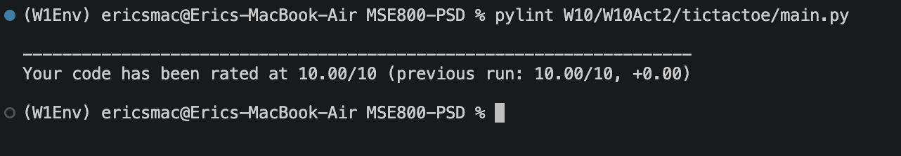
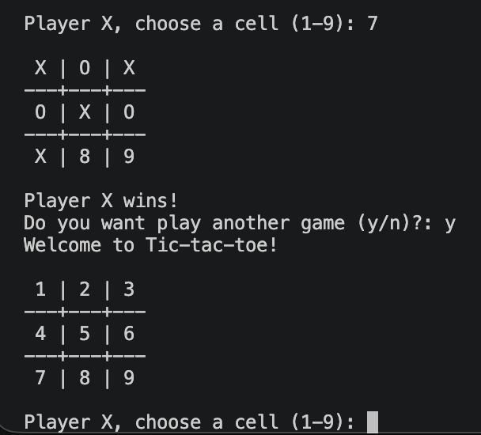

# Week 10 – Activity 2: Tic-tac-toe Game development

A two-player, terminal-based Tic-tac-toe game. Suitable for two players take turns entering a cell number from 1 to 9; the
program validates each move, redraws the board, and reports a win or a draw.
After each match the player can choose to play again. The code is written to a
strict quality bar: a clean `flake8` run and a perfect `10.00/10` `pylint`
score.

### Single Responsibility Principle

Every class has exactly one reason to change:

- `Board` holds the grid state and the game rules, and does no input or output.
- `ConsoleMoveProvider` is responsible only for reading and validating a move.
- `ConsoleView` is responsible only for displaying the board and messages.
- `Game` is responsible only for the flow of a match.

### Liskov Substitution Principle

`Game` stores its collaborators as the abstract types `MoveProvider` and
`GameView` and calls only their abstract methods, so any subclass can be
substituted in without changing the behaviour of the game loop.

## OOP Structure

All of the code lives in `main.py`, organised into six types across four
responsibilities.

- `Board`: pure state and rules, with no input or output. It stores the nine
  cells as a flat list initialised to the `EMPTY` sentinel, and exposes
  `is_free()`, `place()`, `winner()`, and `is_full()`. Positions are 1-based in
  the public API and converted to 0-based internally. The `1`..`9` labels are
  not stored; they are added only when the board is drawn.
- `MoveProvider`: abstract base class that defines the `get_move()` interface
  for supplying a player's move.
- `ConsoleMoveProvider`: concrete provider that reads from the terminal and
  runs the validation loop, rejecting non-numbers, out-of-range values, and
  cells that are already taken.
- `GameView`: abstract base class that defines the `show_board()` and
  `announce()` output interface.
- `ConsoleView`: concrete view that renders the board to a string (numbering
  the free cells) and prints the board and messages.
- `Game`: coordinates the match — player rotation and the win/draw loop —
  depending only on the `MoveProvider` and `GameView` abstractions.
- `main()`: the entry point, guarded by `if __name__ == "__main__"`, which runs
  matches in a play-again loop.

The project also demonstrates the four main object-oriented programming
principles.

- **Abstraction** is implemented through the `MoveProvider` and `GameView`
  abstract base classes, which define *what* a move source and an output
  channel must do without committing to *how* it is done.
- **Inheritance** is demonstrated by `ConsoleMoveProvider` and `ConsoleView`,
  which inherit from those abstract base classes and provide the concrete
  terminal implementations.
- **Polymorphism** is seen in `Game`, which calls `get_move()`, `show_board()`,
  and `announce()` on its collaborators without knowing their concrete type, so
  any substituted subclass works unchanged.
- **Encapsulation** is demonstrated by `Board`, which keeps the cell data
  private to itself; the rest of the program never touches the cell list
  directly and instead goes through `Board`'s methods.

## Code Quality: flake8 and pylint

The project is held to strict PEP 8 and a perfect static-analysis score. The
two abstract single-method classes carry a documented
`# pylint: disable=too-few-public-methods`, the standard idiom for
interface/strategy classes.

`flake8` reports no violations, and `pylint` rates the module `10.00/10`.

### pylint score

## Sample Outputs

