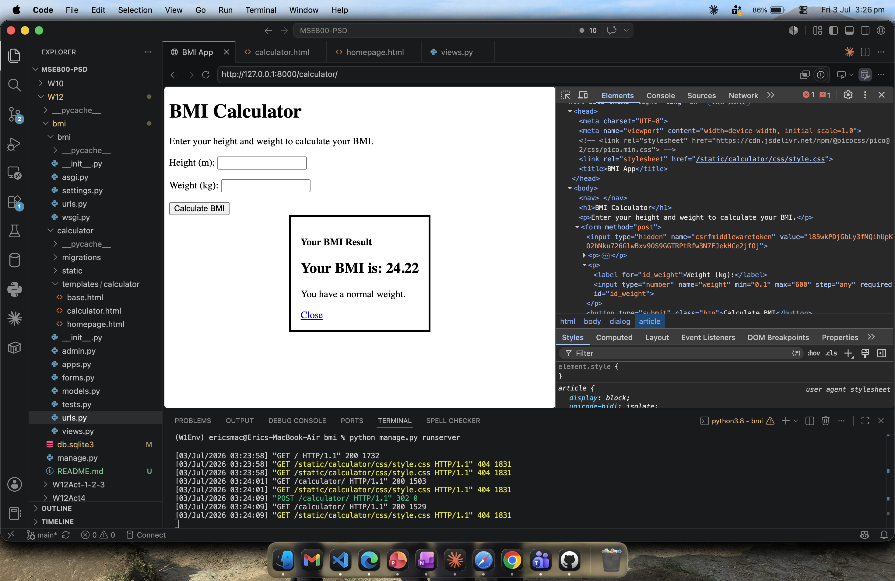

# Week 12 – Activity 5: Django – BMI Calculator

[](https://github.com/eirikrbe/MSE800-PSD/tree/main/W12/bmi)

Django web application that calculates a user's Body Mass Index (BMI)
from their height and weight, classifies the result, and displays it in a modal
dialog. The main purpose of this activity is to practise Django forms, request
handling, and template rendering in a small full-stack app.

## Overview

The user enters their height (in metres) and weight (in kilograms) on the
calculator page. The app validates the input, computes the BMI using
`weight / height²`, and shows the result along with its category
(Underweight, Normal, Overweight, or Obese).



## Features

- **Form validation** — input is handled by a Django `Form`, which converts and
  validates the values and rejects empty, non-numeric, or out-of-range entries.
- **POST/Redirect/GET** — after a successful submission the view redirects, so
  refreshing the page does not resubmit the form.
- **Result modal** — the BMI result is shown once in a pop-up dialog using the
  session to carry the value across the redirect.


## BMI Categories

| BMI range | Category |
|---|---|
| Below 18.5 | Underweight |
| 18.5 – 24.9 | Normal weight |
| 25.0 – 29.9 | Overweight |
| 30.0 and above | Obese |

## Tech

Python, Django,

## Running

```bash
pip install django
python manage.py migrate
python manage.py runserver
```

Then open `http://127.0.0.1:8000/` in the browser.
