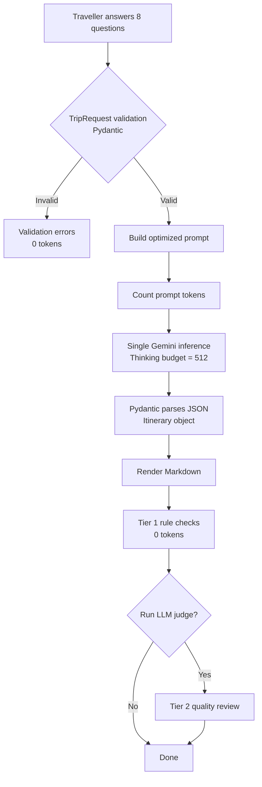

# Week 13 – Activity 2: LLM-Powered New Zealand Travel Itinerary Generator

[](https://github.com/eirikrbe/MSE800-PSD/tree/main/W13/W13Act2)

Command-line program that generates a self-drive New Zealand travel itinerary
with the Google Gemini API. The traveller answers eight questions (trip length,
month, route, budget, transport, interests, age) and the program makes one API
call that returns a schema-enforced JSON itinerary; the program then renders it
to Markdown and evaluates its own output. The main features are prompt engineering, token-cost control, and evaluation of LLM output through LLM-as-judge.
output.

## Overview

The program runs as a pipeline:



1. **Validate input**: a Pydantic `TripRequest` model checks every answer
   (days 1–21, a real month name, a sensible age) before the program calls
   the API; hence, invalid input never costs tokens.
2. **One Gemini call**: the program builds the prompt from the validated
   answers and forces the response into the `Itinerary` schema through
   `response_schema`, so the output is always valid JSON instead of free text.
3. **Render**: the itinerary object becomes a Markdown file that opens with an
   honest feasibility note.
4. **Evaluate**: free rule checks always run; an optional LLM-as-judge call
   triages the remaining issues by severity.

Unlike a traditional software application, an LLM application cannot assume
that every generated response is correct; therefore, this project treats the
LLM as a probabilistic component rather than a deterministic function. Instead
of trusting the first response, the application not only validates the input
and constrains the output with a schema, but also measures the token usage,
performs rule-based verification, and optionally asks a second LLM to critique
the result.

## The Optimized Prompt

The prompt combines five techniques: a role persona in the system instruction,
delimiters that separate the traveller data from the instructions, numbered
hard constraints, a few-shot quality example, and an escape hatch that
instructs the model to admit when the request itself is infeasible instead of
silently breaking a constraint.

System instruction:

```text
You are Kiri, a senior New Zealand travel planner with 20 years of experience
designing self-drive itineraries. You know real driving times between NZ towns,
seasonal conditions (e.g. Tongariro Crossing and high-country roads in winter),
and you never invent places that do not exist.
```

User prompt template (the `{fields}` are filled from the validated
`TripRequest`):

```text
Plan a New Zealand trip using the traveller details below.

### TRAVELLER DETAILS
- Trip length: {days} days
- Travel month: {month}
- Start city: {start_city}
- End city: {end_city}
- Budget level: {budget}
- Transport: {transport}
- Interests: {interests}
- Traveller age: {age}

### HARD CONSTRAINTS
1. Maximum 3 activities per day; fewer on long driving days.
2. Driving legs must be realistic for NZ roads (assume ~70 km/h average).
   Never schedule more than 4.5 hours of driving in one day.
3. Every activity must be a real, named place with its real town.
4. Match activities to the travel month (season, opening, weather).
5. Match intensity to the traveller's age and stated interests.
6. Day 1 starts in {start_city}; the final day ends in {end_city}.
7. Keep each day's total load (driving hours + activity hours) under 9 hours.
8. Use the stated transport for the entire trip — no flights. A rental car
   crosses Cook Strait via the Interislander ferry (Wellington to Picton,
   about 3.5 hours; rental cars are normally swapped at the ferry terminals).
9. If driving_note says 'No driving today', every activity that day must be
   walkable or reachable by local transport from the base town.
10. If the route, trip length and transport cannot all fit within the driving
    cap, still produce the best itinerary you can, but say so honestly in
    feasibility_note and recommend a change (more days, a different start
    city, or allowing one domestic flight). Never hide a broken constraint.

### QUALITY EXAMPLE (one day, for style and detail level only — do not copy)
Day 3 — Base: Rotorua. Driving: Taupo to Rotorua via SH5, about 1 hour.
Activities: Te Puia (Hemo Rd, Tihiotonga, Rotorua) — geothermal valley and
Maori cultural centre; watch the Pohutu geyser and a carving school in action,
a relaxed 3-hour visit that suits any fitness level.

Now produce the full {days}-day itinerary in the required JSON structure.
```

## Sample AI-Generated Itinerary

[itinerary_Christchurch_to_Queenstown_2026-07-07.md](itinerary_Christchurch_to_Queenstown_2026-07-07.md)
contains the full generated output for a 7-day December trip from Christchurch
to Queenstown, with a mid-range budget and a rental car.

## Token-Cost Optimization

The first run billed 5,129 tokens; 71% of that total corresponded to thinking
tokens, which Gemini bills at the expensive output rate. Capping the thinking
budget with `ThinkingConfig(thinking_budget=512)` reduced the bill by two
thirds without degrading the quality of the itinerary.

| Version | Total billed tokens |
|---|---|
| First run (unlimited thinking) | 5,129 |
| Thinking capped at 512 | 1,719 |

In order to keep the cost visible, the program also prints its own usage after
every call: `count_tokens` before sending the prompt, and `usage_metadata`
(input / thinking / output) after receiving the response.

## Self-Evaluation of the Output

- **Tier 1, rule checks (0 tokens)**: plain Python re-tests the hard
  constraints on the returned JSON (day count and numbering, activities per
  day, the 4.5 h driving cap, the 9 h daily load, the packing-tip count, and
  that the trip really ends in the requested city).
- **Tier 2, LLM-as-judge (optional, one extra call)**: a second model reviews
  the itinerary for problems that code cannot check, such as invented places,
  unrealistic driving times, or a poor season fit, and sorts every finding
  into critical (trip-breaking), warnings (the trip survives), or suggestions
  (improvements). Severity buckets proved far more useful than 1–5 scores,
  which were noisy and conflated "route impossible" with "museum is 45 minutes
  further than implied".

## Tech

Python, Google Gemini API (`google-genai`), Pydantic, python-dotenv

## Running

```bash
pip install google-genai pydantic python-dotenv
```

Create a `.env` file next to the script (never commit it):

```text
GEMINI_API_KEY=your_key_here
```

Then:

```bash
python W13Act2.py
```

## Future Work

A future version could make the model self-check before returning: the program
would feed the judge's critical findings back to the generator for one
automatic revision pass (generate, evaluate, repair), so that the itinerary
the user finally sees has already passed its own review.
