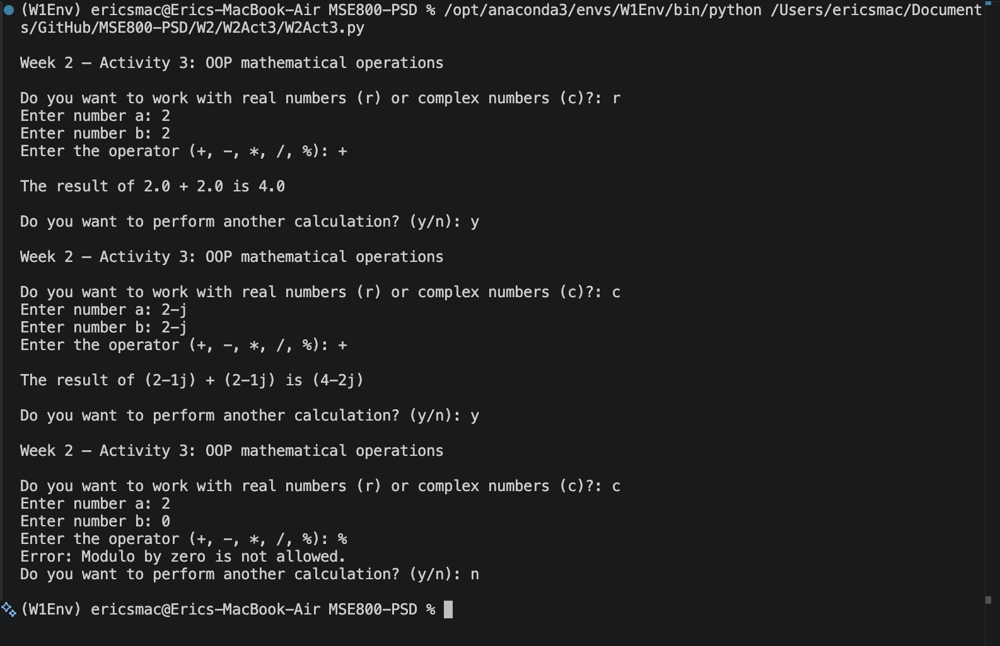

# Week 2 – Activity 3: OOP mathematical operations

[](https://github.com/eirikrbe/MSE800-PSD/tree/main/W2/W2Act3)

A command-line calculator that performs basic mathematical operations with real and complex numbers, using one class with five methods and four functions


## Features

- Supports real and complex number arithmetic.
- Handles five operators: +, -, *, /, %.
- The result is stored as a private attribute.
- The result is only accessible through property getter. 
- Displays clear error messages for invalid operations.
- Prompts users to re-enter if the input is invalid.
- Option to continue or exit after each calculation.

## Usage
```bash
python W2Act3.py
```

### Screenshot



### Example Interaction

```
Do you want to work with real numbers (r) or complex numbers (c)?: r
Enter number a: 2
Enter number b: 2
Enter the operator (+, -, *, /, %): +
The result of 2.0 + 2.0 is 4.0
Do you want to perform another calculation? (y/n): y
Do you want to work with real numbers (r) or complex numbers (c)?: c
Enter number a: 2-j
Enter number b: 2+j
Enter the operator (+, -, *, /, %): *
The result of (2-1j) * (2+1j) is (5+0j)
Do you want to perform another calculation? (y/n): y
Do you want to work with real numbers (r) or complex numbers (c)?: r
Enter number a: 2
Enter number b: 0
Enter the operator (+, -, *, /, %): /
Error: Division by zero is not allowed.
Do you want to perform another calculation? (y/n): n
```

## Error Handling

- Dividing by zero displays: `Error: Division by zero is not allowed.`
- Modulo by zero displays: `Error: Modulo by zero is not allowed.`
- Modulo with complex numbers displays: `Error: Modulo operation is not supported for complex numbers.`

## Environment

- Python 3.8.20
- Anaconda (W1Env)
- Visual Studio Code