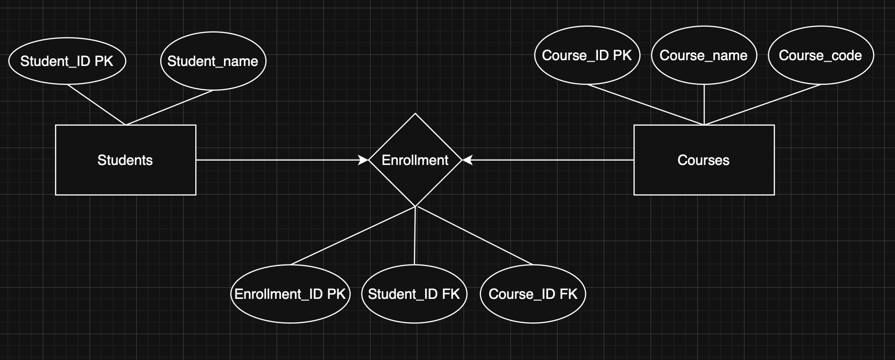
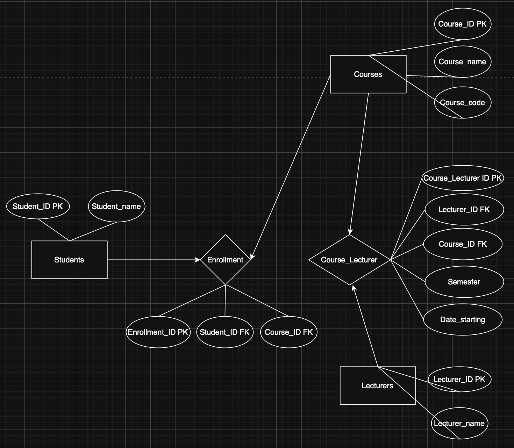

# Week 3 – Activity 1: Database Design

It is a Design of many-to-many base, where one student can get many courses and one course can have many student. This is through a third table named enrollment

# Act 1.1

The system now have two more tables, one is lectures and the other is Course_lecturer where it has the many to many relation between Courses and Lecturer 

