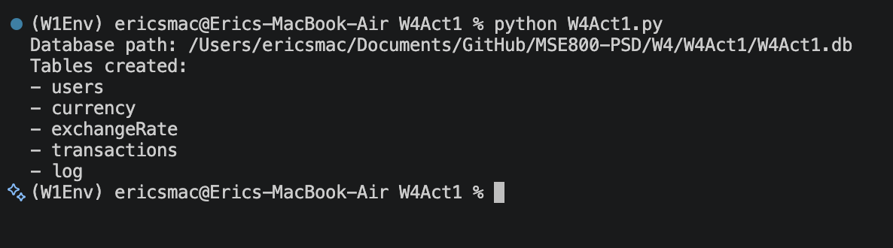

# Week 4 – Activity 2: SQLite3 - Python Database creation    

## Finance money exchange software application.

The data base contains five entities for a finance  money exchange software application. The purpose of the database design is to organise the main data required for a system where users can exchange money between different currencies.

## Data Base

## Entities: 

1. Users
2. Currency
3. Exchange
4. Transaction 
5. Log

## Attributes  

1. Users

stores personal information about users

- User id (PK)
- Registration date
- User full name
- User phone
- User email

2. Currency

stores information about the supported currencies in the system

- Currency id (PK)
- Currency code
- Currency name
- Currency country
- Currency symbol

3. ExchangeRate

stores the exchange rate between two currencies

- Exchange id (PK)
- From currency id (FK)
- To currency id (FK)
- Exchange rate
- Exchange date

4. Transaction

stores information about each operation made by user

- Transaction id (PK)
- User id (FK)
- Exchange id (FK)
- Transaction Fee
- Amount from
- Amount to
- Transaction status
- Transaction date

5. Log

stores the history status relate to each transaction 

- Log id (PK)
- Transaction id (FK)
- Time stamped
- Transaction status
- Status message

## Relationships 

### Users - Transaction

**Relationship type:** 1:N

One user can make many transactions, but each transaction belongs to one user

### Currency - ExchangeRate

**Relationship type:** 1:N

One currency can be used in many exchange rates as the source currency

### Currency - ExchangeRate

**Relationship type:** 1:N

One currency can be used in many exchange rates as the target currency

### ExchangeRate - Transaction

**Relationship type:** 1:N

One exchange rate can be used in many transactions, but each transaction uses one exchange rate

### Transaction - Log

**Relationship type:** 1:N

One transaction can have many log records, but each log record belongs to one transaction