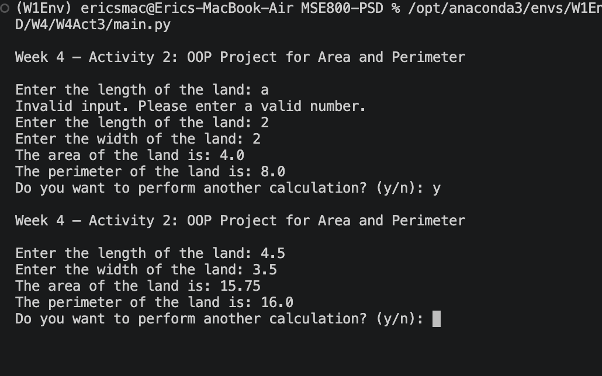

# Week 4 – Activity 2: 

## OOP Land Area and perimeter calculator

This is a object-oriented project, it allows users to input the dimensions of a # rectangular piece of land and calculates both its area and perimeter.

## ### Screenshot

The class is designed as an abstract base to support the calculation of both regular and irregular land areas through the extension of additional child classes.

