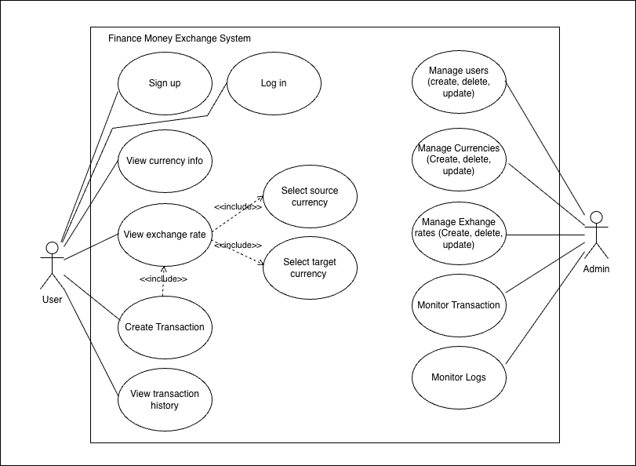
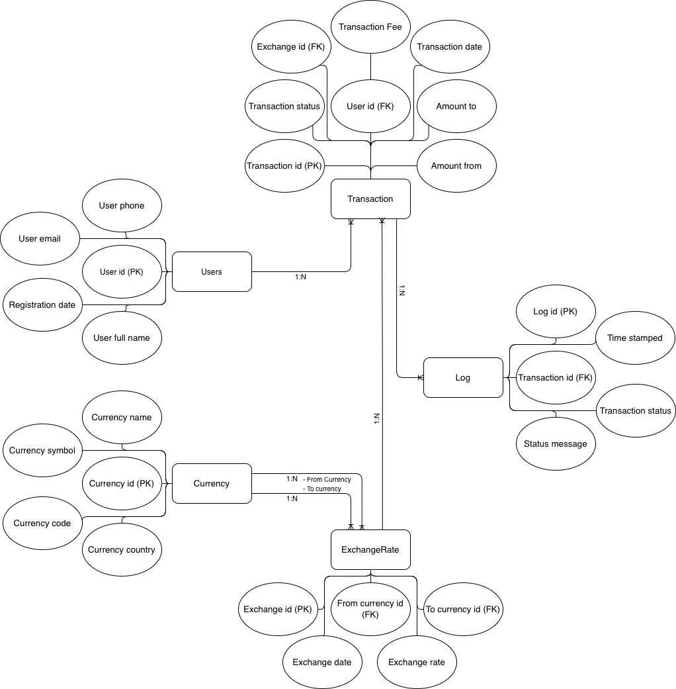

# Week 4 – Activity 3: Use Case diagrams

## Finance money exchange software application. - Use Cases

The use case diagrams are based on the database design created in Week 3 Activity 2 and show how the main actors (User and Admin) interact with the system.

## Use Case Diagram 1: Customer Operations

### Purpose
The user diagram shows the main functions available to a customer. The user can create an account, log in, view currency information, check exchange rates, create exchange transactions and view transaction history. 

### Key Actor
- **user**: A person who uses the system to check exchange rates and create money exchange transactions.

### Main Use Cases
- Sign up
- Log in
- View currency information
- Check exchange rate
- Select source currency
- Select target currency
- Create transaction
- View transaction history

### Relationships

- The user is associated with the main use cases they can perform.
- `Check exchange rate` includes `Select source currency`.
- `Check exchange rate` includes `Select target currency`.
- `Create transaction` includes `Check exchange rate`.

---

## Use Case Diagram 2: Admin Operations

### Purpose
The Admin diagram shows the main functions available to the administrator. The admin is responsible for managing users, currencies, exchange rates, transactions, and system logs.

### Key Actor
- **Admin**: A system administrator who manages and monitors the overall operation of the finance money exchange system.

### Main Use Cases
- Log in
- Manage users
- Manage currencies
- Manage exchange rates
- Monitor transactions
- Monitor logs

## Finance money exchange software application. - ER Diagram

