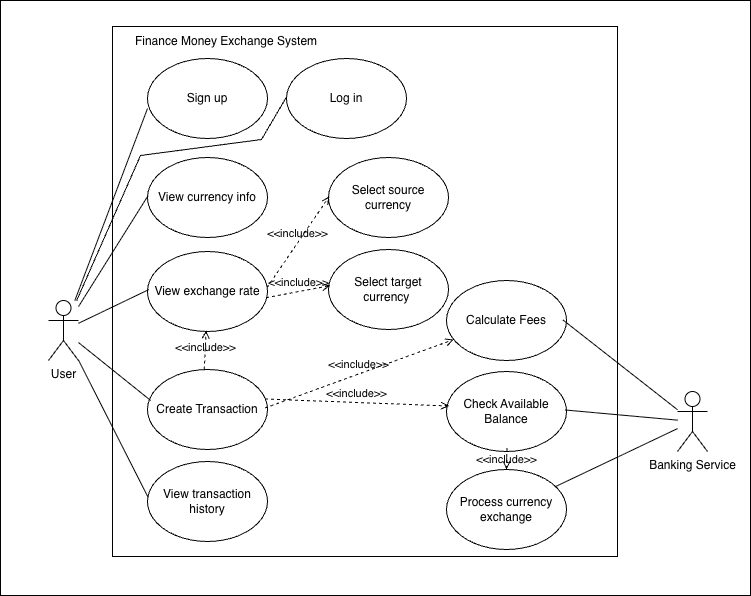

# Week 5 – Activity 1: Use case Scenario Diagram

## Finance money exchange software application. - Use Cases

The use case scenario diagrams is based on the database design created in Week 3 Activity 2 and show how the main actor: User

## Use Case Diagram: Customer Operations

### Purpose
The user diagram shows the main functions available to a customer and the main interactions between the user, the finance money exchange system, and the banking service. The user can create an account, log in, view currency information, check exchange rates, create exchange transactions and view transaction history. 

### Key Actor
- **user**: A person who uses the system to check exchange rates and create money exchange transactions.

### Main Use Cases
- Sign up
- Log in
- View currency information
- Check exchange rate
- Select source currency
- Select target currency
- Create transaction
- View transaction history

### Banking Service

The **Banking Service** is an external supporting actor. It represents the bank or external financial service that supports the application by checking balances, calculating fees, and processing currency exchange transactions.

The banking service supports the following operations:

- Calculate fees
- Check available balance
- Process currency exchange

### Relationships

- The user is associated with the main use cases they can perform.
- `Check exchange rate` includes `Select source currency`.
- `Check exchange rate` includes `Select target currency`.
- `Create transaction` includes `Check exchange rate`.
- `Create transaction` includes `Calculate fees`
- `Create transaction` includes `Check available balance`
- `Check available balance` includes `Process currency exchange`

---

## Finance money exchange software application. - ER Diagram

