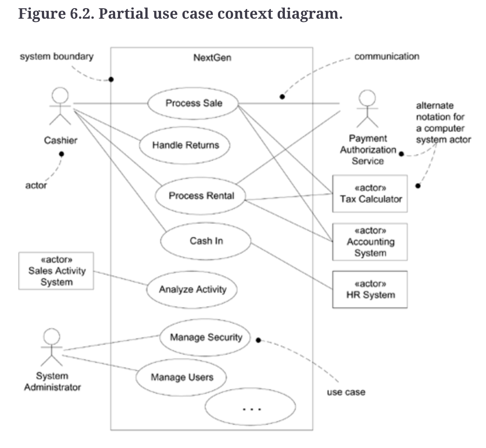

# Week 5 – Activity 2: Explain use-case diagram

Figure 6.2 is a use case scenario diagram that represents a system boundary called NextGen. 

The `Cashier` is one of the main actors. The cashier can interact with the system through cases such as `Process Sale`, `Handle Returns`, `Process Rental`, and `Cash In`.

The `System Administrator` is another actor. This actor is mainly responsible for administrative tasks, such as `Manage Security` and `Manage Users`.

The diagram also shows the external system and actors. For example, the `Payment Authorisation` `Service` is involved in payment processes such as `Process Sale` and `Process Rental`. 

The `Tax Calculator` and `Accounting System` are also involved in `Process Sale` and `Process Rental`.

The `Sales Activity System` is connected to `Analyse Activity`. Finally, the `HR System` is connected to `Cash In`.