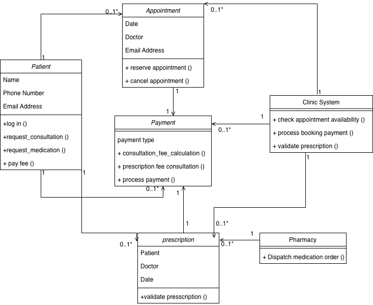
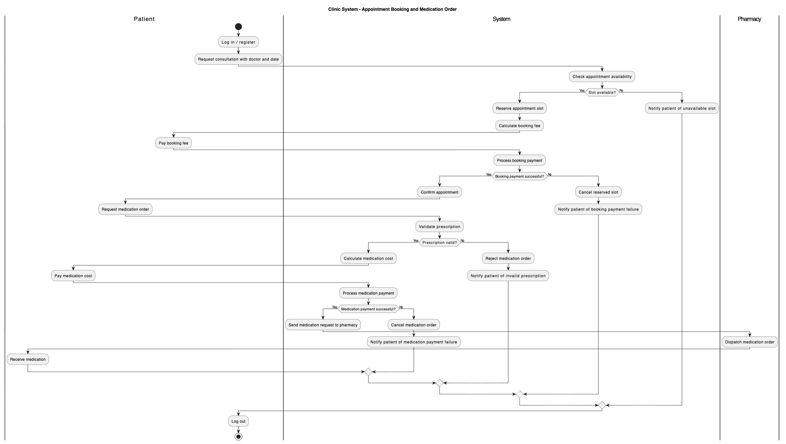

# Week 5 – Activity 3: Class Diagram for a Clinic (W5-A3)

This is an Activity Diagram Class design for a basic Clinic System (W5-A3), The diagram represents the main classes involved when a patient books an appointment, pays the booking fee, requests medication, validates a prescription, pays for the medication, and receives the medication from the pharmacy.

---

## Class Diagram

The diagram includes the following classes:

- Patient
- Appointment
- Payment
- Prescription
- Clinic System
- Pharmacy

Each class has attributes and methods related to its responsibility in the system.

### Week 5 – Activity 3: Clinic System - Appointment Booking and Medication Order

