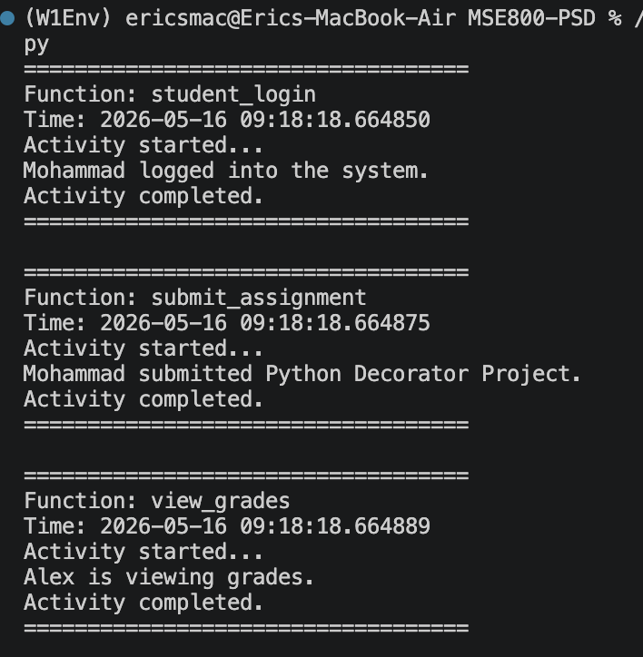

# W6 Act 1- Decorator - analysing the code

## Debugging process

The main program calls three different decorated functions: `student_login()`, `submit_assignment()`, and `view_grades()`. Each of these functions uses the same decorator, `log_activity()`.

The main purpose of `log_activity()` is to record and display activity information before and after the original function runs. It shows the name of the function being called, the current time, when the activity starts, and when the activity is completed.

The decorator uses `*args` and `**kwargs` to capture the arguments passed into the original function. `*args` is used for positional arguments, while `**kwargs` is used for keyword arguments. This makes the decorator flexible because it can be applied to different functions, even if they receive different types or numbers of arguments.

