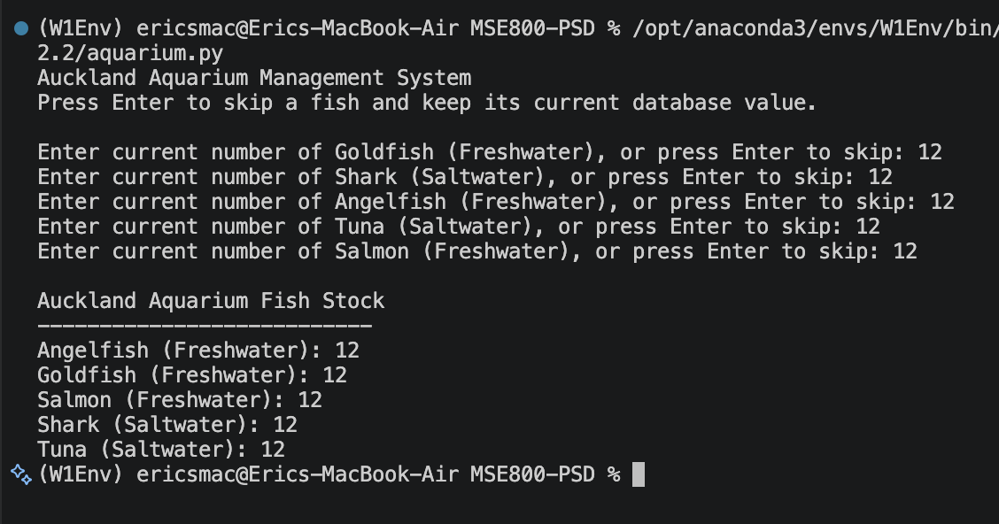

# Week 7 – Activity 2: Use design patterns in your project implementation

The app manages fish stock for an aquarium in Auckland and displays each fish species (Goldfish, Shark, Angelfish, Tuna and salmon), category (Freshwater adn Saltwater), and the number of fish currently available.

## Design Choice

Instead of storing only the fish name, this project stores both:

- `species`: the exact fish, such as Goldfish, Shark, or Salmon.
- `category`: the general aquarium group, either Freshwater or Saltwater.

This makes the output clearer and more useful because the aquarium can show the specific fish and the type of environment it belongs to.

## Design Patterns Used

### Factory Pattern

The `FishFactory` class creates fish objects based on user input. This keeps object creation in one place instead of creating fish directly throughout the program.

The factory also stores the available fish species used by the input loop.

This is efficient for the project because adding another fish later only requires adding the new class and registering it in the factory dictionary.

### Singleton Pattern

The `Aquarium` class uses the Singleton pattern so the program has only one aquarium stock record. Every time `Aquarium()` is called, it returns the same object.

This is useful because the aquarium should have one shared inventory and one database connection.

In this project, the Singleton pattern prevents the program from creating multiple separate aquarium managers with different database connections.

## OOP Structure

- `Fish`: abstract parent class for all fish. It requires each fish to provide a `species()` and `category()`.
- `Goldfish`, `Shark`, `Angelfish`, `Tuna`, `Salmon`: child classes that represent each fish species.
- `FishFactory` (Factory): creates the correct fish object.
- `Aquarium` (Singleton):  class that stores and displays the fish stock using SQLite.
