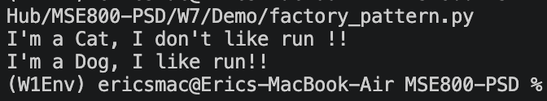

# W7 Activity 1 - Develop a Project Using Factory Design Pattern

[](https://github.com/eirikrbe/MSE800-PSD/tree/main/W7/W7Act1)

## Changes

Some changes were made to make the functionality of the **Factory hierarchy** and **Product hierarchy** easier to understand.

| Change | Description |
|---|---|
| DogFactory implemented | The `DogFactory` class now creates and returns a `Dog` object. |
| CatFactory implemented | The `CatFactory` class now creates and returns a `Cat` object. |
| Factory hierarchy improved | The factory subclasses now properly implement the abstract `create_product()` method. |
| Product hierarchy clarified | The `Dog` and `Cat` classes act as concrete products created by the factories. |

### DogFactory and CatFactory

```python
class DogFactory(Factory):
    
    def create_product(self, kind=None):
        return Dog()


class CatFactory(Factory):
    
    def create_product(self, kind=None):
        return Cat()
```

### Main'

Also, now the main is not bypassing the factory (`dog = Dog()`), instead, factory is creating the product (real function of a factory)

```python

    # client
    dfactory = DogFactory()
    cfactory = CatFactory()
    cat = cfactory.create_product()
    dog = dfactory.create_product()
    cat.run()
    dog.run()

```

### output



## Overview

This project demonstrates the use of the **Factory Design Pattern** in Python. The program creates different animal objects, such as a dog and a cat, by using factory classes instead of creating the objects directly in the client code.

The main purpose of this activity is to show how object creation can be separated from the main program logic. This makes the code more organised, reusable, and easier to extend.


## Hierarchies

### Factory

```text
Factory (ABC)
    ├── AnimalFactory
    ├── DogFactory
    └── CatFactory
```

### Product

```text
Animals (ABC)
    ├── Dog
    └── Cat
```

## ABC abstract method

- Factory - create_product() - Every factory must know how to create a product, so every factory subclass must to create_product()
- Animals - run() -  Every animal must know how to run, but every animals would have their own behavior 

The `Factory` class is an abstract parent class for the factory hierarchy. It contains the abstract method `create_product()`. This means that any class that inherits from `Factory`, such as `DogFactory`, `CatFactory`, or `AnimalFactory`, must implement this method.