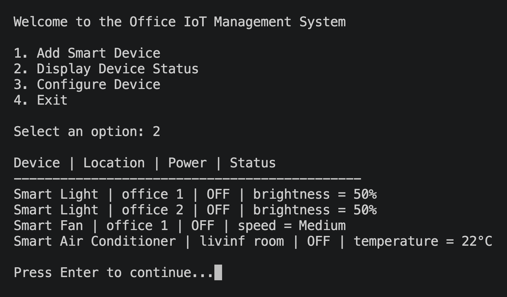
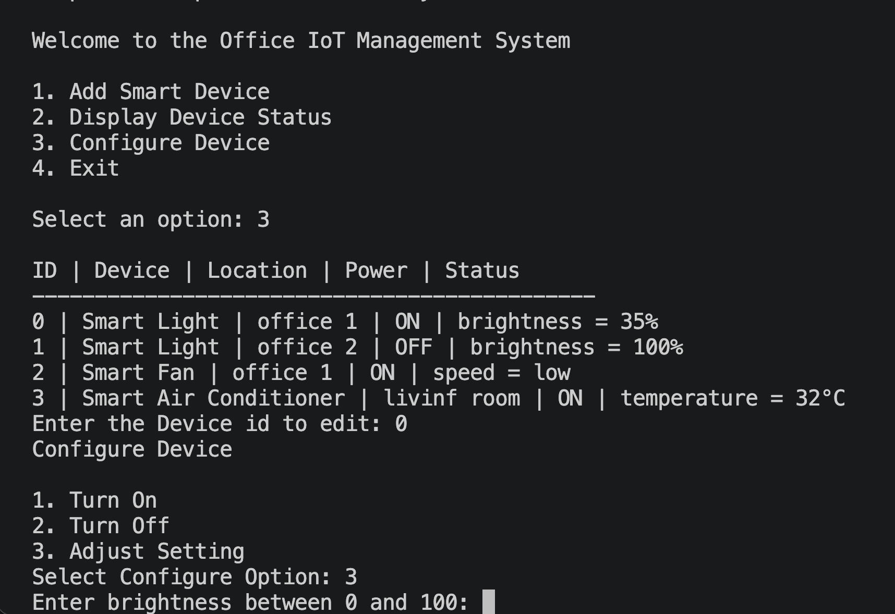

# Week 7 – Activity 3: Office IoT Management System

The app allows a user to create and manage smart office devices, including a Smart Light, Smart Fan, and Smart Air Conditioner. Each device has a location, power status, and a specific setting, such as brightness, speed, or temperature.

## Design Patterns Used

### Factory Pattern

The `DeviceFactory` class uses the Factory Pattern to create smart device objects dynamically based on the device type selected by the user.

The factory stores a dictionary that maps device type keys to the correct class:

- `light` creates a `SmartLight`
- `fan` creates a `SmartFan`
- `aircon` creates a `SmartAirConditioner`

This avoids a long `if/elif` chain and keeps the object creation logic in one place. If another smart device is added later, the new device class can be registered in the factory dictionary.

### Singleton Pattern

The `DeviceManager` class uses the Singleton Pattern to ensure that the application only has one shared device manager during runtime.

This behaviour is implemented using both the `__new__()` and `__init__()` methods in Python.

- `__new__()` is responsible for creating a new object instance. In the `DeviceManager` class, `__new__()` checks whether an instance already exists. If no instance exists, it creates one and stores it in a class variable. If an instance already exists, it simply returns the existing object instead of creating a new one.
- `__init__()` is responsible for initializing the object after it has been created. Since `__init__()` runs every time `DeviceManager()` is called, the class uses an `_initialized` flag to prevent the device list from being reset multiple times.

This approach ensures that all parts of the application share the same device manager and the same device collection throughout the program execution.

## OOP Structure

- `SmartDevice`: abstract parent class for all smart devices. It stores common attributes such as device location and power status. It also provides shared methods such as `turn_on()` and `turn_off()`.
- `SmartLight`: child class that represents a smart light and includes a brightness setting.
- `SmartFan`: child class that represents a smart fan and includes a speed setting.
- `SmartAirConditioner`: child class that represents a smart air conditioner and includes a temperature setting.
- `DeviceFactory`: creates the correct smart device object based on the selected device type.
- `DeviceManager`: Singleton class that stores and retrieves the smart devices created during runtime.
- `main.py`: handles the menu, user input, device creation, device display, and device configuration.

The project also demonstrates the four main object-oriented programming principles through the smart device class hierarchy and supporting classes.

- `Abstraction` is implemented in the `SmartDevice` parent class found in `models.py`. This class defines the common structure and behaviour shared by all smart devices, such as `location`, `power_status`, `turn_on()`, `turn_off()`, and `display_status`(). The main program interacts with devices through this shared interface without needing to know the internal implementation details of each specific device type.
- Inheritance is demonstrated by the child classes `SmartLight`, `SmartFan`, and `SmartAirConditioner`, which inherit from the `SmartDevice` base class. These subclasses automatically reuse the common functionality defined in `SmartDevice` while also adding their own unique attributes and methods. For example:

`SmartLight` adds a `brightness` attribute.
`SmartFan` adds a `speed` attribute.
`SmartAirConditioner` adds a `temperature` attribute.

- Polymorphism can be seen in the `display_status()` method implemented differently in each child class. Even though the    `DeviceManager` stores all devices together in one list, the program can call `display_status()` on any device object and Python automatically executes the correct version depending on the actual object type. This allows the system to treat all devices uniformly while still producing device-specific output.
- Encapsulation is demonstrated by keeping device data and behaviour together inside each class. Each smart device manages its own internal state, such as power status, brightness, speed, or temperature, through methods like `turn_on()`, `turn_off()`, `set_brightness()`, `set_speed()`, and `set_temperature()`. The main program does not directly manipulate internal attributes; instead, it interacts with devices through controlled methods, helping maintain valid device behaviour and improving code organisation.

## Sample Outputs

### Default Device Status Before Configuration

### Device Status After Configuration

