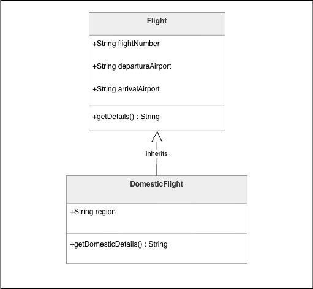

# Week 8 – Activity 3: Single inheritance - Air New Zealand


[](https://github.com/eirikrbe/MSE800-PSD/tree/main/W8/W8Act3)


This project demonstrates an example of object-oriented programming in Python using inheritance. The program creates a general `Flight` class and a more specific `DomesticFlight` class that inherits from it.

The purpose of the project is to show how a child class can reuse attributes from a parent class while also adding its own specific attribute.

## Classes Used

### Flight

The `Flight` class is the parent class. It stores the general information that all flights should have:

* flight number
* departure airport
* arrival airport

It also includes a method called `get_flight_details()` that returns the basic flight information.

### DomesticFlight

The `DomesticFlight` class is the child class. It inherits the flight number, departure airport, and arrival airport from the `Flight` class.

It also adds one extra attribute:

* region

The class includes a method called `get_domestic_details()` that returns the full domestic flight information.

## OOP Concept Demonstrated

This project demonstrates inheritance.

Inheritance allows a child class to reuse the attributes and methods of a parent class. In this program, `DomesticFlight` inherits from `Flight`, which avoids creating all flight details from scratch again.

The `super()` function is used inside the child class constructor to call the parent class constructor.

## Program Output

When the program runs, it creates one domestic flight object and displays its details.

Example output:

```text
Domestic Flight Number = abc123, Departure Airport Auckland, Arrival Airport Queenstown, Region south island
```


### Class Diagram



