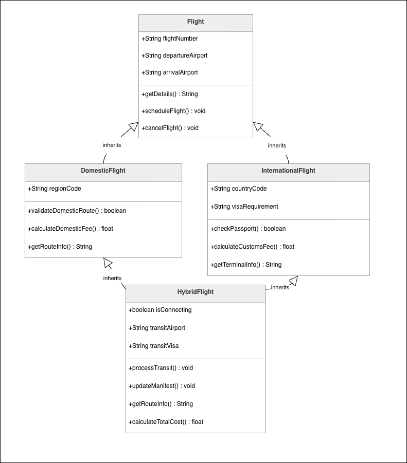
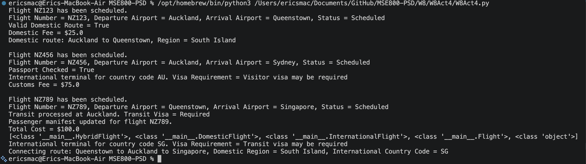

# Week 8 - Activity 4: Flight Management System

[](https://github.com/eirikrbe/MSE800-PSD/tree/main/W8/W8Act4)

This project demonstrates hybrid inheritance. The program uses one parent class, two child classes, and one class that inherits from both child classes.


## Class Diagram



## Classes

### Flight

`Flight` is the parent class. It stores the general information that all flights need:

* `flightNumber`
* `departureAirport`
* `arrivalAirport`
* `status`

Methods:

* `get_flight_details()`
* `schedule_flight()`
* `cancel_flight()`

### DomesticFlight

`DomesticFlight` inherits from `Flight`. It represents flights within the same country.

Extra attribute:

* `regionCode`

Methods:

* `validate_domestic_route()`
* `calculate_domestic_fee()`
* `get_route_info()`

### InternationalFlight

`InternationalFlight` inherits from `Flight`. It represents flights between different countries.

Extra attributes:

* `countryCode`
* `visaRequirement`

Methods:

* `check_passport()`
* `calculate_customs_fee()`
* `get_terminal_info()`

### HybridFlight

`HybridFlight` inherits from both `DomesticFlight` and `InternationalFlight`.

This class represents a connecting route that has a domestic part and an international part.

Example:

```text
Queenstown -> Auckland -> Singapore
```

Extra attributes:

* `isConnecting`
* `transitAirport`
* `transitVisa`

Methods:

* `process_transit()`
* `update_manifest()`
* `get_route_info()`
* `calculate_total_cost()`

## Hybrid Inheritance

This project uses hybrid inheritance because it combines hierarchical inheritance and multiple inheritance.

`DomesticFlight` and `InternationalFlight` both inherit from `Flight`.

`HybridFlight` then inherits from both `DomesticFlight` and `InternationalFlight`.

This allows `HybridFlight` to use domestic flight features and international flight features in one class.

For example, this method uses behaviour from both parent classes:

```python
def calculate_total_cost(self):
    return self.calculate_domestic_fee() + self.calculate_customs_fee()
```

## Test Example


### Hybrid Flight Example

```python
hybrid1 = HybridFlight(
    flightNumber="NZ789",
    departureAirport="Queenstown",
    arrivalAirport="Singapore",
    regionCode="South Island",
    countryCode="SG",
    visaRequirement="Transit visa may be required",
    isConnecting=True,
    transitAirport="Auckland",
    transitVisa="Required"
)
```

This tests a connecting flight:

```text
Queenstown -> Auckland -> Singapore
```


## Example Output


