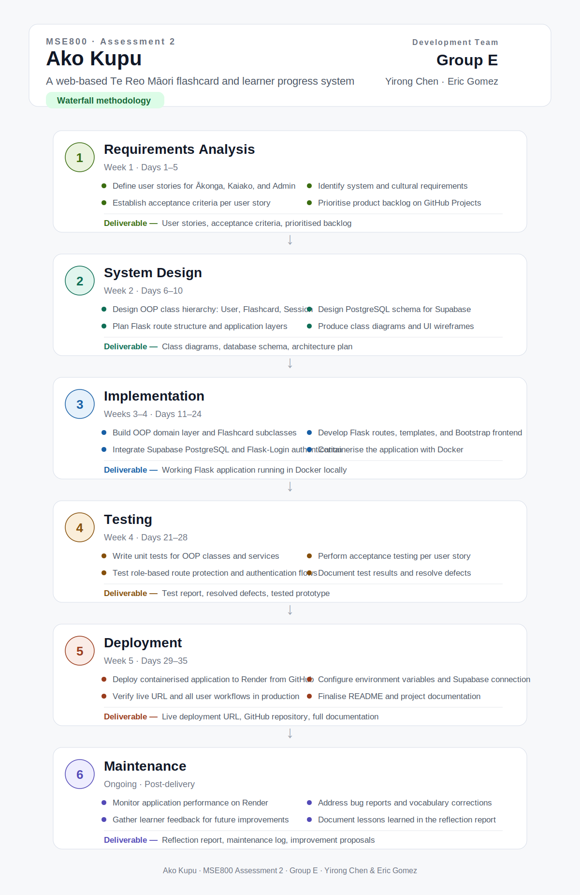

# Ako Kupu – Waterfall Project Management Diagram

## Overview

This folder contains the Waterfall project management diagram for **Ako Kupu**, a web-based Te Reo Māori flashcard and learner progress system developed for **MSE800 Assessment 2**

**DEVELOPMENT TEAM - Group E**

- Yirong Chen
- Eric Gomez

## Diagram

## Timeline Summary

| Phase | Timeframe | Deliverable |
|---|---|---|
| Requirements Analysis | Week 1, Days 1–5 | User stories, acceptance criteria, prioritised backlog |
| System Design | Week 2, Days 6–10 | Class diagrams, database schema, architecture plan |
| Implementation | Weeks 3–4, Days 11–24 | Working Flask application running in Docker locally |
| Testing | Week 4, Days 21–28 | Test report, resolved defects, tested prototype |
| Deployment | Week 5, Days 29–35 | Live deployment URL, GitHub repository, full documentation |
| Maintenance | Post-delivery | Reflection report, maintenance log, improvement proposals |

## Technology Context

The project uses Python, Flask, Flask-Login, bcrypt, Supabase PostgreSQL, psycopg2, Render, Bootstrap, Docker, GitHub, and GitHub Projects.
