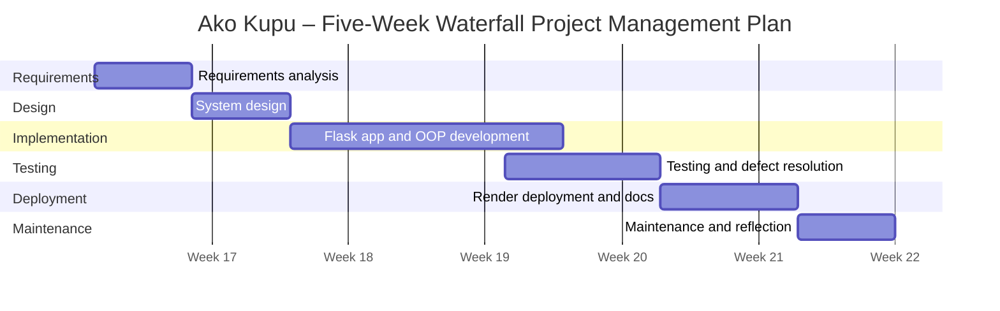

# Ako Kupu – Waterfall Project Management Diagram

## Overview

This document presents the five-week Waterfall project management plan for **Ako Kupu**, a web-based Te Reo Māori flashcard and learner progress system developed for **MSE800 Assessment 2** by **Group E**.

The diagram shows the project moving through six phases: requirements analysis, system design, implementation, testing, deployment, and maintenance. Each phase includes a clear timeframe and expected project focus.

## Waterfall Timeline

## Phase Summary

| Phase | Timeframe | Main Focus | Deliverable |
|---|---|---|---|
| Requirements Analysis | Week 1, Days 1–5 | Define user stories, acceptance criteria, cultural requirements, and backlog priorities | User stories, acceptance criteria, prioritised backlog |
| System Design | Week 2, Days 6–10 | Design OOP structure, PostgreSQL schema, Flask routes, and UI wireframes | Class diagrams, database schema, architecture plan |
| Implementation | Weeks 3–4, Days 11–24 | Build the Flask app, OOP domain layer, Supabase integration, authentication, Bootstrap frontend, and Docker setup | Working Flask application running locally in Docker |
| Testing | Week 4, Days 21–28 | Test OOP classes, user workflows, authentication, protected routes, and acceptance criteria | Test report, resolved defects, tested prototype |
| Deployment | Week 5, Days 29–35 | Deploy the application to Render, configure environment variables, verify Supabase connection, and finalise documentation | Live deployment URL, GitHub repository, full documentation |
| Maintenance | Post-delivery | Monitor the application, fix issues, gather feedback, and document future improvements | Reflection report, maintenance log, improvement proposals |

## Technology Context

The project uses the following technology stack:

| Area | Technology |
|---|---|
| Language | Python |
| Web Framework | Flask |
| Authentication | Flask-Login + bcrypt |
| Database | Supabase PostgreSQL |
| Database Driver | psycopg2 |
| Deployment | Render |
| Frontend | Bootstrap |
| Containerisation | Docker |
| Version Control and Project Management | GitHub + GitHub Projects |

## Purpose

This diagram supports project planning by showing how each development phase connects to a specific timeframe, project activity, and deliverable. It also provides evidence of structured project management for the Ako Kupu web application.
